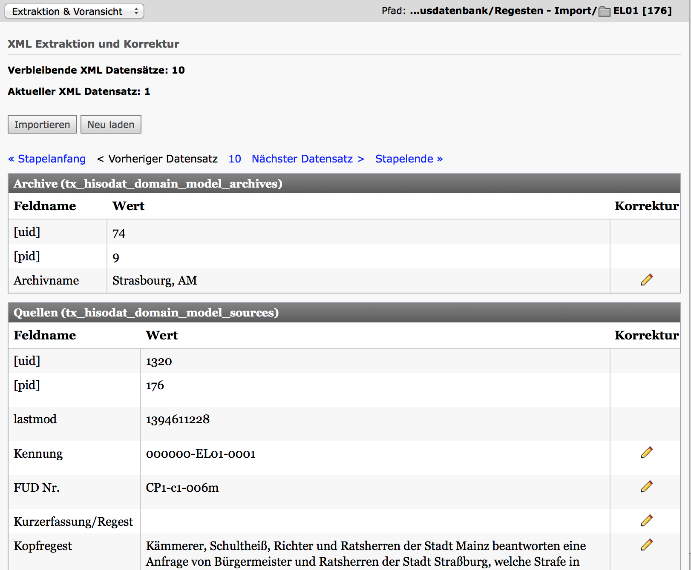
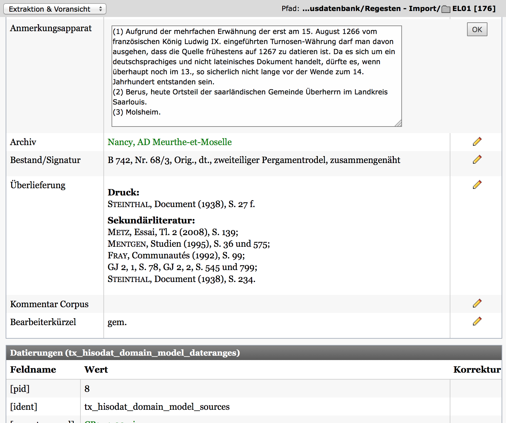
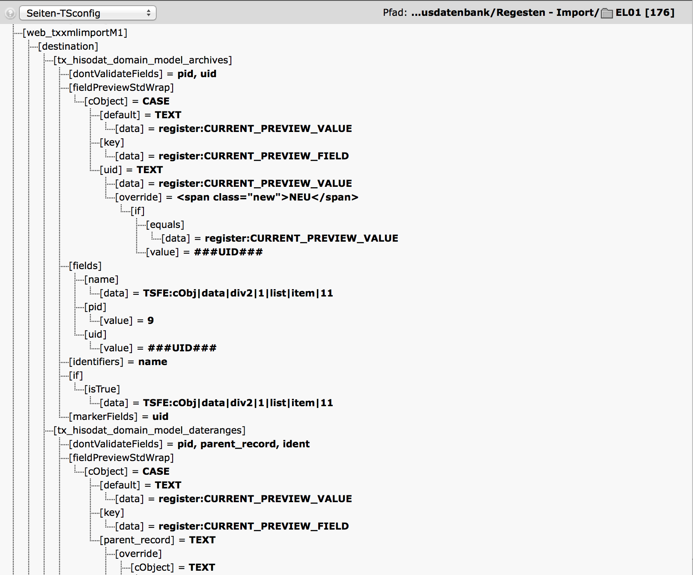

XML Import Module
==================

TYPO3 backend module for importing XML records by TypoScript (and XPATH/XSLT). Crazy idea? Yes, but nothing beats it's flexibility.

## Features:

* Backend import module with preview / edit functionality
* Pagebound import configuration with pure TypoScript
* Pre- & Postprocessor Hooks
* Configurable import queue
* Batch import

## Screenshots

## Requirements

TYPO3 4.5.x

## Please note

This is an alpha version because there is no real documentation yet. The code is quite old school TYPO3 backend stuff. The module itself has been in use for several years and a million records have been imported.